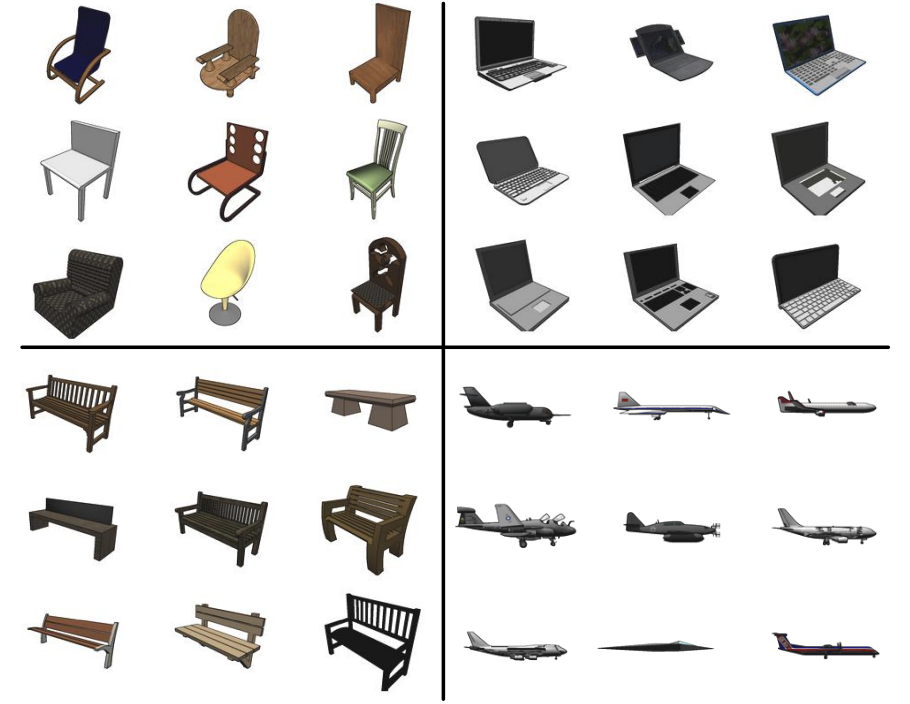
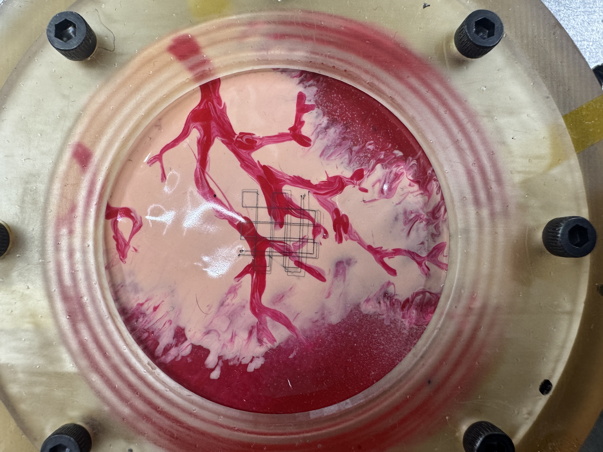

# Conceptual Design: 3D Point Cloud Enhancement for On-the-Fly 3D Printer Control
## Description
To 3D print on a dynamic surface, a six-axis robotic arm utilizes a high frequency depth and color camera to create an RGBD 3D point cloud of the surface to be printed on. This allows the printer to observe the shape change of the surface for a period of time and use that data to predict the shape of the surface at the time of the next point it needs to print using a RNN algorithm. However, this workflow faces some challenges due to the variation in quality of the 3D point clouds produced by the camera. As the camera is high frequency, it is inherently low resolution. Additionally, the camera produces point clouds that are particularly noisy in the vertical direction and the camera is incapable of filling in all differently colored areas of the surface given specific lighting and exposure settings. Therefore, in order to perform more precise control of the printer a pipeline for denoising, completing, and upsampling 3D point clouds will be created in this project. Most of the datasets and ideas explored here to carry out these tasks come from this [review article](https://arxiv.org/html/2411.00857v1#bib.bib32).

## Datasets
Vast collections of datasets, including both synthetic and real-world objects, exist tailored toward training models to carry out each of the three enhancement goals (denoising, completing, and upsampling). As the application is focused on interacting with real-world objects, datasets composed of real-world objects will be the focus, however, it is a concern that the main area of application for this printer (printing on a beating heart) will be too far outside the scope of the objects included in these databases. Some examples of datasets containing real-world objects and ground truth pairs considered for these goals are: [denoising](https://wang-ps.github.io/denoising.html), [completing](https://github.com/yushuang-wu/SCoDA) (synthetic objects), and [upsampling](https://github.com/hkust-vgd/scanobjectnn). These datasets are all very large and can be broken into sections for training and validation. The data for testing the model will come from conducting scans with the robotic arm printer.

## Denoising
Most work completed in the denoising of PCDs involve supervised methods that either focus on refining point locations or surface normals of the point clouds. Point-based methods either estimate the displacement of noisy points needed to rectify the model, estimate the true surface from the noisy points and resample points on it, or employ gradient ascent. Normal-based methods tend to be more precise and focus on refining the surface normals and then adjusting the points to match. Other techniques offer a combination of both or incorporate layered information to address local and global shape. Unsupervised techniques rely on having high density PCDs to extract the underlying surface and tend to struggle with fine detail.

## Completion
Object-level PCD completion typically rely on point-based or image-assisted strategies. One-stage point-based techniques estimate characteristics from the input to generate a complete PCD. Meta-point-based techniques extract global geometric features during learning to approximate the PCD and then use local geometry to refine it. Deformation-based methods iteratively update a complete point cloud to match the input PCD shape. Image-assisted strategies use a single view image of the object to provide more information for the completion. This technique is of interest for the current project, as the camera takes an image during the creation of the PCD.

## Upsampling
Upsampling can largely be broken into two different areas, embedded space and 3D Euclidean space. The 3D Euclidean space techniques seem to be more applicable to this application, as they operate by adding more points into the Euclidean space instead of manipulating feature vectors in latent space. Two main categories in this area include refinement-base and surface-reconstruction-based techniques. Refinement-based techniques augment existing points, but generate points with imprecise locations (which necessitates further processing). Surface-reconstruction-based methods estimate the underlying surface in the sparse point cloud first and then adds additional points. 

## Metrics
In order to evaluate these methods, various metrics to compare PCDs can be utilized. The chamfer distance is the distance between each point in one set and the nearest point to that point in the other set. The Hausdroff distance evaluates the greatest of all the distances from a point in one point cloud to the closest point in the other point cloud. Point-to-face and point-to-mesh distances evaluate the distance from points to an underlying surface or mesh. The normalized uniformity coefficient evaluates the distribution of points across designated areas on an object’s surface. 

## Conclusion
It is unknown whether completing a pipeline of point cloud enhancement capable of all three goals is within the scope of the project, however, at the very least one goal will be implemented. All three goals can likely be implemented in series by combining existing open-source methods, but as they have overlapping techniques and ideas it may be possible to implement them simultaneously. It is currently thought that unsupervised methods of each goal should be the focus, as the intend application should be adaptable to unforeseen environments. However, for specific application scenarios ground truth models can be provided for supervised techniques if necessary.

# Refined Conceptual Design: Point Cloud Distribution Upsampling for On-the-Fly 3D Printer Control
As one of the most pressing issues with the depth and color camera used for on-the-fly robotic arm printer control is the low resolution of the PCDs produced by the camera, upsampling has been chosen as the point of focus for this project. The technique for upsampling PCDs will be based off of the [PU-Dense](https://aniqueakhtar.github.io/publications/PU-Dense/) architecture, as it is trained on widely available synthetic models (which can be used as the ground-truth and sparsely sampled to create PCDs) and still demonstrates great performance when applied to real-world scans. Databases with objects exhibiting features similar to the intended use case will be selected to train the model. The results of this version of the model will be evaluated to further curate the training data to improve any features with poor performance. Finally, if poor performance is still observed, another model will be created to synthesize data to fill in remaining gaps in the training data.

# Training, Validation, and Testing Databases

### ShapeNet
 The [ShapeNetCore](https://shapenet.org/) database covers 55 common object categories with about 51300 unique 3D models. Initially, following the framework of development for PU-Dense, around 24000 randomly selected models from the database will be used to train the model and 1024 models to validate it, in order to try to recreate the results from the paper.  The mesh models will be sampled into point clouds by randomly generating points on the surfaces of the mesh, then randomly rotating and quantizing the point cloud to 7-bit precision. The size of the point clouds in the dataset will be between 5000 to 50000 points per point cloud. The type of data in this dataset is 3D mesh models of various common place objects, including airplanes, trashcans, bags, baskets, bathtubs, skateboards, wine glasses, pillows, etc. If the performance seems to be poor as a result of too many of the same object type being favored in the training or validation sets, then the dataset will be randomly broken up into training, validation, and testing categories based on the common 60% - 20% - 20% split for each of the 55 object categories. At the time of writing, this dataset has not yet been downloaded as I am still awaiting approval from its managers.
### ScanObjectNN
 The [ScanObjectNN](https://hkust-vgd.github.io/scanobjectnn/) database is a real-world scanned object dataset which contains around 15000 objects that are categorized into 15 categories with 2902 unique object instances. This dataset contains low-resolution sparse point clouds with 2048 points per point cloud. Examples of objects in this dataset include bags, beds, sinks, toilets, sofas, etc. Initially, this dataset will act as wider variety testing set, to examine the performance of the model on real-world scans. If the model seems to struggle with these real-world objects in the testing phase, then objects from this dataset can be downsampled (to create input-ground-truth pairs) to be incorporated into the training and validation data. This dataset will be randomly broken up into training, validation, and testing categories based on the common 60% - 20% - 20% split for each of the 15 object categories. At the time of writing, this dataset has been successfully downloaded. 

### Self Taken Scans
 As the ultimate test for the model and the purpose of the project, scans will be taken with the robotic arm printer and fed into this model for upsampling. A collection of example scans of the printing surface have already been obtained, but it is desired to demonstrate the upsampling as a direct part of the printing workflow. The surface this will be tested on is a silicon membrane resembling the veiny surface of the heart that is pneumatically actuated to inflate and deflate.